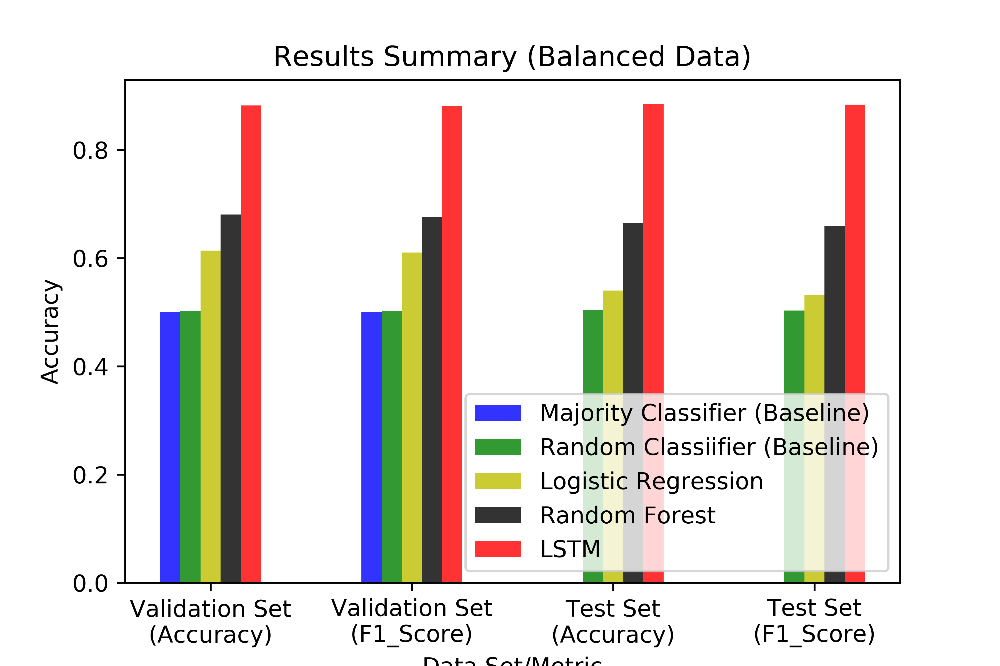

# Quora Insincere Questions Classification (Kaggle Datasets)
Contains all files required to be submitted for the coding part of hw5
 
**NOTE: My best results were obtained using an RNN. The model which I trained is too big (170MB) a file to upload to either gradescope/github. Its results are illustrated in the jupyter notebook though.**

TL;DR  run ‘test.py’

### Scenarios Tested
The following two cases were tested - 
1. Imbalanced Data
2. Balanced Data

### Compared Methods
In each case, 5 classifiers were trained and tested - 
1. Majority Classifier (always predict 0)
2. Random Classifier
3. Logistic Regression
4. Random Forest
5. LSTM

### Data Pre-processing
The balanced dat was obtained by under sampling and was feasible to train on a local machine to obtain the models. The imbalanced data was too large to process on my local machine. 

Thus, the file(s)
1. ‘train.py’ contains training procedure for all models. This script loads the training data, processes it, trains ALL models for both balanced/imbalanced cases, and saves the models along with the validation/test data.

2. ‘test.py’ contains the testing procedure for the models trained on balanced data i.e. it uses the 5 classifiers trained on the balanced training data, to predict the labels of the balanced validation and test data. Running the script prints out a tabulated summary of the accuracies and f1 scores, and generates a bar chart summary of all the results.

### Results
 

  
  

